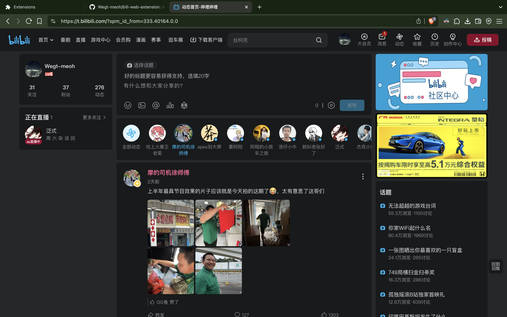

# A web extension for bilibili

## Features

* open links in self tab -->(except search)
* The step value of the volume change becomes 5% -->(except 100%->90% and 0->10%)
* dark theme

## Screenshots

## Download

* download the zip file on the [release page](https://github.com/Wegt-meoh/bili-web-extension/releases)

## Usage

### firefox

1. enter this site `about:debugging#/runtime/this-firefox`
1. click `Load Temporary Add-on...`
1. choose the file `manifest.json` which under the project root directory

### chrome

1. click extensions in the top right of your browser
1. click manage extensions
1. click load unpacked
1. choose this project directory

### safari

no support now
